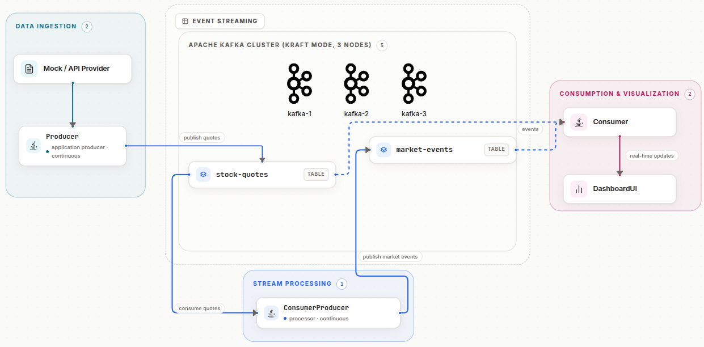
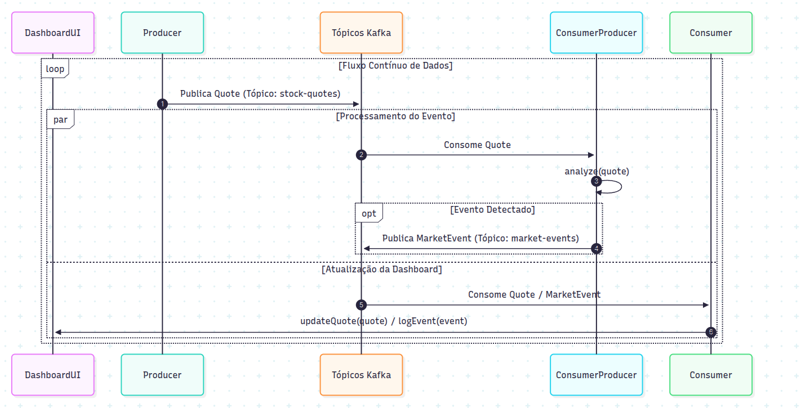
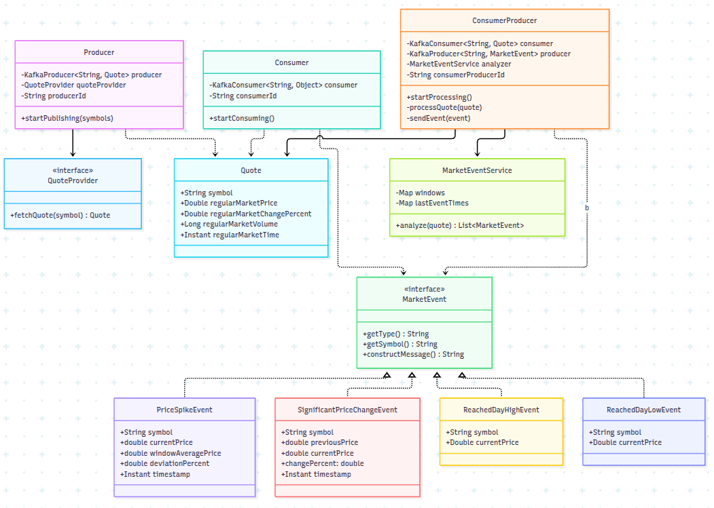

# Stocks Monitoring 📈

Trata-se de um sistema orientado a eventos que utiliza dados da API da BRAPI para monitorar informações relacionadas a ações da bolsa de valores.

## Funcionalidades
* Monitoramento de ações da bolsa de valores em tempo real
* Monitoramento de notícias relacionadas a ações da bolsa de valores em tempo real, dentre os quais: 
  * Máximas e mínimas do dia.
  * Mudança de preço significativa em relação ao fechamento do dia anterior.
  * Pico de preço significativo em relação a uma janela de contexto de de no mínimo 5 minutos.


## Requisitos
* Java 17
* Docker
* Docker Compose
* Possuir uma chave de API da `brapi.dev`

## Configurando a chave de API
Crie um arquivo `.env` na raiz do projeto e adicione seu token da BRAPI:
```bash
BRAPI_TOKEN=seu_token_aqui
```

## Subindo o cluster
No diretório onde está o `docker-compose.yaml`, execute:

```bash
sudo docker compose up -d
```

Verifique se os 3 containers estão no ar:

```bash
sudo docker compose ps
```

## Parar o ambiente
```bash
sudo docker compose down
```

Para remover também os volumes (dados):
```bash
sudo docker compose down -v
```

## Troubleshooting

Para subir o cluster nos computadores do LabGrad sem sudo, execute o seguinte comando: 

```bash
dockerd-rootless-setuptool.sh install
```

## Diagramas 

### Diagrama da Arquitetura do Sistema


## Diagrama de Sequência do Sistema


## Diagrama UML de Classes do Sistema
